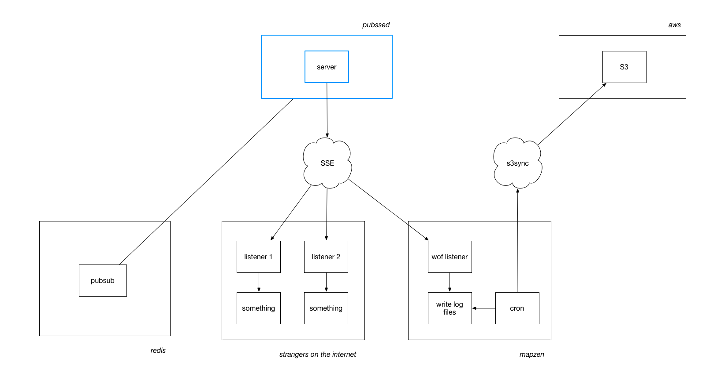

# go-pubssed



Listen to a Redis PubSub channel and then rebroadcast it over Server-Sent Events (SSE).

## Install

You will need to have both `Go` (specifically version [1.12](https://golang.org/dl/) or higher) and the `make` programs installed on your computer. Assuming you do just type:

```
make tools
```

All of this package's dependencies are bundled with the code in the `vendor` directory.

## Packages

### broker

```
import (
	"github.com/whosonfirst/go-pubssed/broker"
	"net/http"
)

brkr, _ := broker.NewBroker()
brkr.Start("localhost", 6379, "pubssed")

http_handler, _ := brkr.HandlerFunc()

mux := http.NewServeMux()
mux.HandleFunc("/", http_handler)
http.ListenAndServe("localhost:8080", mux)
```

_Note that all error handling has been removed for the sake of brevity._

### listener

```
import (
	"github.com/whosonfirst/go-pubssed/listener"
	"log"
)

callback := func(msg string) error {
	log.Println(msg)
	return nil
}

lstnr, _ := listener.NewListener("http://localhost:8080", callback)
lstnr.Start()
```

_Note that all error handling has been removed for the sake of brevity._

## Tools

### pubssed-broadcast

```
./bin/pubssed-broadcast -h
Usage of ./bin/pubssed-broadcast:
  -clients int
    	Number of concurrent clients (default 200)
  -redis-channel string
    	Redis channel (default "pubssed")
  -redis-host string
    	Redis host (default "localhost")
  -redis-port int
    	Redis port (default 6379)
```

A simple command-line application for spewing as many messages (timestamps) as possible to a PubSub channel for testing how a `pubssed` server will handle the load.

### pubssed-client

```
./bin/pubssed-client -h
Usage of ./bin/pubssed-client:
  -append-root string
    	The destination to write log files if the 'append' callback is invoked. (default ".")
  -callback string
    	The callback to invoke when a SSE event is received. (default "debug")
  -endpoint string
    	The pubssed endpoint you are connecting to.
  -retry-on-eof
    	Try to reconnect to the SSE endpoint if an EOF error is triggered. This is sometimes necessary if an SSE endpoint is configured with a too-short HTTP timeout (for example if running behind an AWS load balancer).
```

A simple command-line application for subscribing to an SSE server and invoke a callback when an event is received.

#### callbacks

`pubssed-client` is included as a reference implementation for the simplest-dumbest kind of "listener" application so it only has a pair of default callbacks by default.

##### append

Appends each SSE event a file named `YYYY/MM/DD/YYYYMMDDHH.txt` (where datetime specifics are determined based on the time the event is received).

##### debug

Logs each SSE event to STDOUT.

### pubssed-server

```
./bin/pubssed-server -h
Usage of ./bin/pubssed-server:
  -redis-channel string
    	Redis channel (default "pubssed")
  -redis-host string
    	Redis host (default "localhost")
  -redis-port int
    	Redis port (default 6379)
  -sse-endpoint string
    	SSE endpoint (default "/sse")
  -sse-host string
    	SSE host (default "localhost")
  -sse-port int
    	SSE port (default 8080)
```

An actuall living breathing server that will listen to (and relay) a PubSub channel and that an SSE client can connect to and receive messages.

## See also

* https://developer.mozilla.org/en-US/docs/Web/API/Server-sent_events/Using_server-sent_events
* https://github.com/go-redis/redis
* https://github.com/whosonfirst/go-webhookd
* https://github.com/whosonfirst/go-pubsocketd
